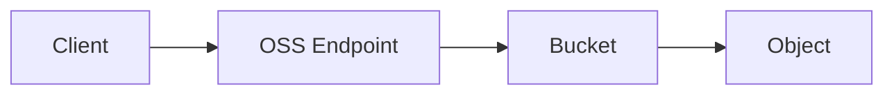

# Alibaba Cloud OSS Documentation - Content Templates

## Overview

This document defines page templates for each content type used in the OSS documentation. Each template specifies the frontmatter structure, section layout, and recommended Mintlify component usage.

---

## Template 1: Concept Page

**Purpose**: Explain what something is and why it matters. Used for foundational concepts like buckets, objects, storage classes, and access control.

**When to use**: Core Concepts section, introductory pages for complex features.

### Frontmatter

```yaml
---
title: "{Feature Name}"
sidebarTitle: "{Short Title}"
description: "Understand {feature} in Alibaba Cloud OSS and when to use it."
"og:title": "{Feature Name} - Alibaba Cloud OSS"
"og:description": "Learn about {feature} in Alibaba Cloud OSS."
---
```

### Section Layout

```mdx
import Prerequisites from '/snippets/prerequisites.mdx';

# {Feature Name}

{One-paragraph overview: what it is, why it matters, 2-3 sentences max.}

## Overview

{Expanded explanation with Cards or Columns for visual structure.}

<CardGroup cols={2}>
  <Card title="{Sub-concept A}" icon="{icon}">
    {Brief description.}
  </Card>
  <Card title="{Sub-concept B}" icon="{icon}">
    {Brief description.}
  </Card>
</CardGroup>

## Key Concepts

{Detailed explanation of the main concepts. Use a table for properties/attributes.}

| Property | Description | Default |
|----------|-------------|---------|
| ...      | ...         | ...     |

## How It Works

{Technical explanation, optionally with a Mermaid diagram.}



## Comparison Table

{If applicable, compare variants/options in a table.}

## Best Practices

<Tip>
{Key recommendations as callout boxes.}
</Tip>

## Related Topics

- [{Related page 1}]({link})
- [{Related page 2}]({link})
```

### Mintlify Components Used
- **CardGroup / Card**: Visual overview of sub-concepts
- **Columns**: Side-by-side comparisons
- **Tables**: Properties, comparisons
- **Mermaid**: Architecture / flow diagrams
- **Tip / Info callouts**: Best practices, important notes

---

## Template 2: Quickstart Page

**Purpose**: Get the user to their first success as quickly as possible. Minimal setup, working code, immediate results.

**When to use**: Getting Started tab, SDK quickstarts.

### Frontmatter

```yaml
---
title: "Quickstart: {Tool/SDK Name}"
sidebarTitle: "{Tool/SDK} Quickstart"
description: "Get started with Alibaba Cloud OSS using {tool/SDK} in 5 minutes."
"og:title": "Quickstart: {Tool/SDK} - Alibaba Cloud OSS"
---
```

### Section Layout

```mdx
import Prerequisites from '/snippets/prerequisites.mdx';

# Quickstart: {Tool/SDK Name}

<Info>
This quickstart takes approximately 5 minutes to complete.
</Info>

## Prerequisites

<Prerequisites />

<Steps>
  <Step title="Install {SDK/Tool}">
    {Installation command with code block.}

    ```bash
    pip install oss2
    ```
  </Step>

  <Step title="Configure Authentication">
    {Authentication setup with code example.}

    ```python
    import oss2
    auth = oss2.Auth('your-access-key-id', 'your-access-key-secret')
    ```

    <Warning>
    Never hardcode credentials in production. Use environment variables or STS temporary credentials.
    </Warning>
  </Step>

  <Step title="Create a Bucket">
    {Create bucket code.}
  </Step>

  <Step title="Upload a File">
    {Upload code.}
  </Step>

  <Step title="Download and Verify">
    {Download and verify code.}
  </Step>
</Steps>

## Next Steps

<CardGroup cols={2}>
  <Card title="{Next action 1}" icon="{icon}" href="{link}">
    {Brief description of what they can do next.}
  </Card>
  <Card title="{Next action 2}" icon="{icon}" href="{link}">
    {Brief description.}
  </Card>
</CardGroup>
```

### Mintlify Components Used
- **Steps / Step**: Numbered walkthrough
- **Info**: Time estimate callout
- **Warning**: Security warnings for credentials
- **CardGroup**: Next steps navigation
- **Code blocks**: Installation and code examples

---

## Template 3: How-to Guide Page

**Purpose**: Task-oriented instructions for a specific operation. Shows how to perform an action with multi-language code examples.

**When to use**: Guides tab for all operational tasks (upload, download, access control, etc.).

### Frontmatter

```yaml
---
title: "{Action Verb} {Resource}"
sidebarTitle: "{Action Verb} {Resource}"
description: "Learn how to {action} in Alibaba Cloud OSS using the console, CLI, or SDK."
"og:title": "{Action Verb} {Resource} - Alibaba Cloud OSS"
---
```

### Section Layout

```mdx
import Prerequisites from '/snippets/prerequisites.mdx';
import SdkInit from '/snippets/sdk-init.mdx';

# {Action Verb} {Resource}

{One-paragraph overview of the operation, when to use it, and any limits.}

<Info>
{Key limit or constraint, e.g., "Maximum object size for simple upload is 5 GB."}
</Info>

## Prerequisites

<Prerequisites />

## {Method 1: e.g., Simple Upload}

{Brief description of this method and when to use it.}

<Tabs>
  <Tab title="Python">
    ```python title="upload_object.py"
    import oss2

    auth = oss2.Auth('access_key_id', 'access_key_secret')
    bucket = oss2.Bucket(auth, 'https://oss-cn-hangzhou.aliyuncs.com', 'my-bucket')

    # Upload from string
    bucket.put_object('example.txt', b'Hello, OSS!')

    # Upload from file
    bucket.put_object_from_file('example.txt', '/path/to/local/file.txt')
    ```
  </Tab>
  <Tab title="Java">
    ```java title="UploadObject.java"
    OSS ossClient = new OSSClientBuilder().build(endpoint, accessKeyId, accessKeySecret);
    ossClient.putObject("my-bucket", "example.txt", new File("/path/to/file.txt"));
    ossClient.shutdown();
    ```
  </Tab>
  <Tab title="Go">
    ```go title="upload_object.go"
    // Go example
    ```
  </Tab>
  <Tab title="Node.js">
    ```javascript title="uploadObject.js"
    // Node.js example
    ```
  </Tab>
</Tabs>

## {Method 2: e.g., Multipart Upload}

<Tip>
{Recommendation, e.g., "Use multipart upload for files larger than 100 MB."}
</Tip>

{Description and multi-language code examples as above.}

## Parameters

{If applicable, a table of important parameters/options.}

| Parameter | Type | Required | Description |
|-----------|------|----------|-------------|
| ...       | ...  | ...      | ...         |

## Error Handling

{Common errors for this operation.}

| Error Code | Cause | Solution |
|------------|-------|----------|
| ...        | ...   | ...      |

## Related Topics

- [{Related guide 1}]({link})
- [{Related guide 2}]({link})
```

### Mintlify Components Used
- **Tabs**: Multi-language code examples (Python, Java, Go, Node.js)
- **Code blocks**: With file names and syntax highlighting
- **Info / Tip / Warning**: Important notes and best practices
- **Tables**: Parameters, error codes
- **Prerequisites snippet**: Reusable prerequisite block

---

## Template 4: API Reference Page

**Purpose**: Detailed REST API endpoint documentation with request/response format.

**When to use**: API Reference tab for each REST API operation.

### Frontmatter

```yaml
---
title: "{OperationName}"
sidebarTitle: "{OperationName}"
description: "{Brief description of what this API does.}"
"og:title": "{OperationName} - Alibaba Cloud OSS API"
---
```

### Section Layout

```mdx
# {OperationName}

{One-sentence description of the operation.}

## Request Syntax

```http
{HTTP_METHOD} /{path}?{query-params} HTTP/1.1
Host: {BucketName}.oss-{region}.aliyuncs.com
Date: {date}
Authorization: {signature}
Content-Type: {content-type}

{Request body if applicable}
```

## Request Parameters

### Path Parameters

| Parameter | Type | Required | Description |
|-----------|------|----------|-------------|
| ...       | ...  | ...      | ...         |

### Query Parameters

| Parameter | Type | Required | Description |
|-----------|------|----------|-------------|
| ...       | ...  | ...      | ...         |

### Request Headers

| Header | Type | Required | Description |
|--------|------|----------|-------------|
| ...    | ...  | ...      | ...         |

### Request Body

{XML or JSON structure with field descriptions.}

```xml
<?xml version="1.0" encoding="UTF-8"?>
<{RootElement}>
  <{Field1}>{value}</{Field1}>
  <{Field2}>{value}</{Field2}>
</{RootElement}>
```

## Response

### Response Headers

| Header | Type | Description |
|--------|------|-------------|
| ...    | ...  | ...         |

### Response Body

```xml
<?xml version="1.0" encoding="UTF-8"?>
<{ResponseRoot}>
  ...
</{ResponseRoot}>
```

## Examples

### Example: {Scenario description}

**Request**

```http
PUT /examplebucket HTTP/1.1
Host: examplebucket.oss-cn-hangzhou.aliyuncs.com
...
```

**Response**

```http
HTTP/1.1 200 OK
x-oss-request-id: 5C3D97...
...
```

## Error Codes

| HTTP Status | Error Code | Description |
|-------------|------------|-------------|
| ...         | ...        | ...         |

## SDK Examples

<Tabs>
  <Tab title="Python">
    ```python
    # SDK equivalent
    ```
  </Tab>
  <Tab title="Java">
    ```java
    // SDK equivalent
    ```
  </Tab>
</Tabs>
```

### Mintlify Components Used
- **Code blocks**: HTTP request/response with syntax highlighting
- **Tables**: Parameters, headers, error codes
- **Tabs**: SDK code examples
- **Note / Warning**: Important constraints

---

## Template 5: SDK Guide Page

**Purpose**: Language-specific SDK documentation for a particular operation category.

**When to use**: SDKs tab for each SDK's operation pages.

### Frontmatter

```yaml
---
title: "{Operation Category} - {SDK Language}"
sidebarTitle: "{Operation Category}"
description: "How to {operation} using the Alibaba Cloud OSS SDK for {language}."
"og:title": "{Operation} with OSS {Language} SDK"
---
```

### Section Layout

```mdx
import SdkInit from '/snippets/sdk-init-{language}.mdx';

# {Operation Category}

{Overview of what operations are covered and when to use them.}

## Prerequisites

<SdkInit />

## {Operation 1}

{Description of this specific operation.}

```{language} title="{filename}"
// Complete working code example
// Include imports, initialization, operation, cleanup
// Add inline comments for key steps
```

<Note>
{Important note about this operation, e.g., size limits, permissions needed.}
</Note>

## {Operation 2}

{Description and full code example.}

```{language} title="{filename}"
// Code example
```

## {Operation 3}

{Description and full code example.}

## Common Patterns

<Accordion title="Error Handling">
```{language}
// Error handling pattern for this SDK
```
</Accordion>

<Accordion title="Retry Logic">
```{language}
// Retry pattern
```
</Accordion>

## Related Topics

- [{Language} SDK: {related operation}]({link})
- [API Reference: {operation}]({link})
- [Guide: {operation}]({link})
```

### Mintlify Components Used
- **Code blocks**: Full working examples with file names
- **Accordion**: Optional details (error handling, advanced patterns)
- **Note / Warning**: SDK-specific caveats
- **Snippets**: SDK initialization (imported per language)

---

## Template 6: Troubleshooting Page

**Purpose**: Help users resolve common issues and errors.

**When to use**: Troubleshooting section for error codes and common problems.

### Frontmatter

```yaml
---
title: "{Issue Category} Troubleshooting"
sidebarTitle: "{Issue Category}"
description: "Solutions for common {issue category} problems in Alibaba Cloud OSS."
"og:title": "Troubleshooting {Issue Category} - Alibaba Cloud OSS"
---
```

### Section Layout

```mdx
# {Issue Category} Troubleshooting

{Brief intro explaining what this page covers.}

## Common Errors

<AccordionGroup>
  <Accordion title="{ErrorCode} ({HTTP Status})">
    **Error Message**: {error message text}

    **Cause**: {explanation of what causes this error}

    **Solution**:

    <Steps>
      <Step title="{Step 1}">
        {Detailed fix instruction}
      </Step>
      <Step title="{Step 2}">
        {Detailed fix instruction}

        ```python
        # Example fix code
        ```
      </Step>
    </Steps>
  </Accordion>

  <Accordion title="{ErrorCode} ({HTTP Status})">
    **Error Message**: {error message text}

    **Cause**: {explanation}

    **Solution**: {fix instructions}
  </Accordion>
</AccordionGroup>

## Diagnostic Checklist

<Steps>
  <Step title="Check credentials">
    Verify AccessKey ID and Secret are correct and active.
  </Step>
  <Step title="Check endpoint">
    Ensure the endpoint matches the bucket's region.
  </Step>
  <Step title="Check permissions">
    Review RAM policies and bucket policies.
  </Step>
  <Step title="Check request">
    Review the RequestId in the error response for support tickets.
  </Step>
</Steps>

## Need More Help?

<Card title="Submit a Ticket" icon="headset" href="https://www.alibabacloud.com/help/en/smart-online">
  Contact Alibaba Cloud support with your RequestId for further assistance.
</Card>
```

### Mintlify Components Used
- **AccordionGroup / Accordion**: Collapsible error entries
- **Steps**: Diagnostic checklists
- **Code blocks**: Fix examples
- **Card**: Support link

---

## Template 7: FAQ Page

**Purpose**: Answer frequently asked questions in a scannable format.

**When to use**: FAQ section organized by topic.

### Frontmatter

```yaml
---
title: "{Topic} FAQ"
sidebarTitle: "{Topic} FAQ"
description: "Frequently asked questions about {topic} in Alibaba Cloud OSS."
"og:title": "{Topic} FAQ - Alibaba Cloud OSS"
---
```

### Section Layout

```mdx
# {Topic} FAQ

<AccordionGroup>
  <Accordion title="{Question 1}?">
    {Clear, concise answer.}

    {If applicable, include a code example or link.}
  </Accordion>

  <Accordion title="{Question 2}?">
    {Answer with supporting details.}

    | Option | Description |
    |--------|-------------|
    | ...    | ...         |
  </Accordion>

  <Accordion title="{Question 3}?">
    {Answer.}

    <Info>
    {Additional context or related information.}
    </Info>
  </Accordion>
</AccordionGroup>

## Related Topics

- [{Related page}]({link})
```

### Mintlify Components Used
- **AccordionGroup / Accordion**: Collapsible Q&A format
- **Tables**: Comparison answers
- **Info callout**: Supplementary context
- **Code blocks**: Inline examples where needed

---

## Template 8: Landing Page (Home)

**Purpose**: Welcome page that orients users and provides quick navigation to key sections.

**When to use**: Site landing page (`get-started/index.mdx`).

### Frontmatter

```yaml
---
title: "Alibaba Cloud OSS Documentation"
sidebarTitle: "Home"
description: "Alibaba Cloud Object Storage Service (OSS) documentation. Learn how to store, manage, and access your data."
"og:title": "Alibaba Cloud OSS Documentation"
---
```

### Section Layout

```mdx
# Alibaba Cloud OSS Documentation

Alibaba Cloud Object Storage Service (OSS) is a secure, cost-effective, and highly reliable cloud storage service with 99.9999999999% data durability.

## Get Started

<CardGroup cols={3}>
  <Card title="What is OSS?" icon="circle-info" href="/get-started/what-is-oss">
    Learn about OSS features, use cases, and architecture.
  </Card>
  <Card title="Quickstart" icon="rocket" href="/get-started/quickstart/sdk">
    Upload your first file in 5 minutes.
  </Card>
  <Card title="Core Concepts" icon="lightbulb" href="/get-started/concepts/buckets">
    Understand buckets, objects, regions, and storage classes.
  </Card>
</CardGroup>

## Popular Guides

<CardGroup cols={2}>
  <Card title="Upload Objects" icon="upload" href="/guides/objects/upload-objects">
    Upload files using the console, CLI, or SDK.
  </Card>
  <Card title="Access Control" icon="shield-halved" href="/guides/access-control/ram-policies">
    Secure your data with RAM policies, STS, and signed URLs.
  </Card>
  <Card title="Image Processing" icon="image" href="/guides/data-processing/image-processing">
    Resize, crop, watermark, and convert images on the fly.
  </Card>
  <Card title="Static Website" icon="globe" href="/guides/advanced/static-website-hosting">
    Host a static website directly from an OSS bucket.
  </Card>
</CardGroup>

## SDKs & Tools

<CardGroup cols={4}>
  <Card title="Java" icon="java" href="/sdks/java/quick-start" />
  <Card title="Python" icon="python" href="/sdks/python/quick-start" />
  <Card title="Go" icon="golang" href="/sdks/go/quick-start" />
  <Card title="Node.js" icon="node-js" href="/sdks/nodejs/quick-start" />
</CardGroup>

## Resources

<CardGroup cols={3}>
  <Card title="API Reference" icon="code" href="/api-reference/overview">
    Complete REST API documentation.
  </Card>
  <Card title="Troubleshooting" icon="wrench" href="/resources/troubleshooting/error-codes">
    Error codes and common solutions.
  </Card>
  <Card title="Best Practices" icon="star" href="/resources/best-practices/performance">
    Optimize performance, security, and cost.
  </Card>
</CardGroup>
```

### Mintlify Components Used
- **CardGroup / Card**: Section navigation with icons
- **Varied column layouts**: 2, 3, 4 columns for visual hierarchy

---

## Reusable Snippets

The following snippets should be created in the `/snippets` directory:

| Snippet File | Content | Used In |
|-------------|---------|---------|
| `snippets/prerequisites.mdx` | Alibaba Cloud account, AccessKey, OSS activation | All quickstarts, guides |
| `snippets/security-warning.mdx` | Warning about hardcoding credentials | Quickstarts, SDK guides |
| `snippets/sdk-init-python.mdx` | Python SDK initialization code | All Python SDK pages |
| `snippets/sdk-init-java.mdx` | Java SDK initialization code | All Java SDK pages |
| `snippets/sdk-init-go.mdx` | Go SDK initialization code | All Go SDK pages |
| `snippets/sdk-init-nodejs.mdx` | Node.js SDK initialization code | All Node.js SDK pages |
| `snippets/sdk-init-php.mdx` | PHP SDK initialization code | All PHP SDK pages |
| `snippets/sdk-init-dotnet.mdx` | .NET SDK initialization code | All .NET SDK pages |
| `snippets/sdk-init-cpp.mdx` | C++ SDK initialization code | All C++ SDK pages |
| `snippets/endpoints-table.mdx` | Region/endpoint reference table | Concepts, quickstarts |
| `snippets/storage-classes-table.mdx` | Storage class comparison table | Concepts, pricing |
| `snippets/support-link.mdx` | Link to support / ticket submission | Troubleshooting pages |
