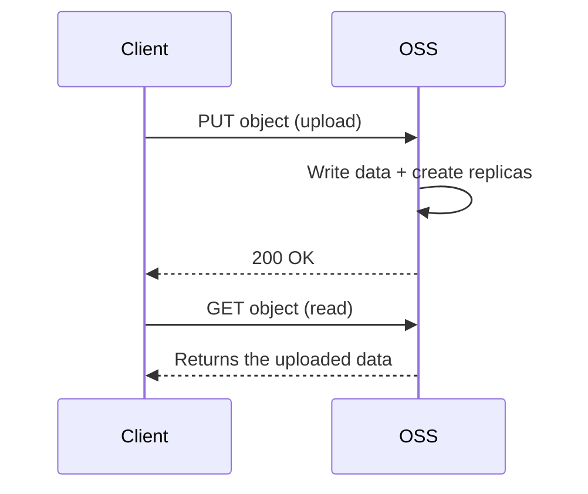

# Consistency Model

OSS provides **strong read-after-write consistency** for all operations. This means you can immediately read the latest version of your data after any write operation completes successfully, with no eventual consistency delays.

## What strong consistency means

<CardGroup cols={2}>
  <Card title="Atomic Operations" icon="atom">
    Object operations are all-or-nothing. An upload either completes fully or fails entirely -- you never encounter partial or corrupted data.
  </Card>
  <Card title="Immediate Visibility" icon="eye">
    After a successful write (PUT/POST/DELETE), all subsequent reads immediately reflect the change. There is no replication lag.
  </Card>
</CardGroup>

## Consistency guarantees

| Operation | Guarantee |
|-----------|-----------|
| **Upload (PUT)** | After receiving a success response, any subsequent `GET` returns the new object. |
| **Overwrite (PUT)** | After a success response, all reads return the new content. The previous version is no longer accessible (unless versioning is enabled). |
| **Delete (DELETE)** | After a success response, the object and all its replicas are removed. Subsequent reads return a 404 error. |
| **List (GET Bucket)** | Object listings immediately reflect new, overwritten, or deleted objects. |
| **Metadata update** | Changes to object metadata are immediately visible in subsequent `HEAD` or `GET` requests. |

## How it works

When you upload an object, OSS creates redundant replicas for durability before returning a success response. This means:

1. You send a `PUT` request to upload an object.
2. OSS writes the object and creates the required replicas.
3. OSS returns a `200 OK` response.
4. From this point, any `GET` request for that object returns the uploaded data.

## Concurrent writes

When multiple clients upload objects with the same key simultaneously to a bucket without versioning:

- The **last write wins** -- the object from the client whose upload completes last is retained.
- OSS determines "last" based on the upload completion time (not start time).
- The operation is still atomic -- readers get either the old or the new version, never a mix.

<Note>
If concurrent overwrites are a concern, enable **versioning** on the bucket. With versioning, each upload creates a new version, and no data is lost.
</Note>

## Comparison with other systems

| System | Consistency Model | Read-After-Write |
|--------|------------------|-----------------|
| **Alibaba Cloud OSS** | Strong consistency | Immediate |
| AWS S3 | Strong consistency (since Dec 2020) | Immediate |
| Google Cloud Storage | Strong consistency | Immediate |
| Some distributed file systems | Eventual consistency | May have delays |

## Implications for your application

Strong consistency simplifies application design because you do not need to:

- Add retry logic for read-after-write scenarios
- Implement polling to wait for data to become available
- Handle stale reads or cache invalidation for recently uploaded objects
- Worry about propagation delays across replicas

<Tip>
You can rely on OSS consistency guarantees when building workflows that upload data and immediately process it (e.g., upload an image then trigger a processing pipeline). The data is guaranteed to be available for processing immediately after the upload succeeds.
</Tip>

## Next steps

- [Objects](/get-started/concepts/objects)
- [Versioning](/guides/data-management/versioning)
- [Upload objects](/guides/objects/upload-objects)
