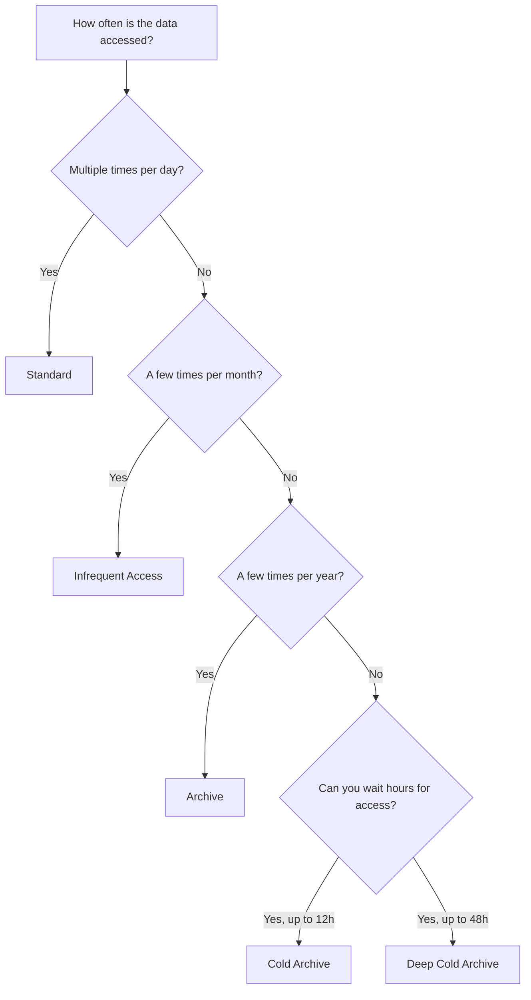

# Storage Classes

OSS provides five storage classes to match different data access patterns and cost requirements. By choosing the right storage class, you can significantly reduce storage costs while maintaining the performance your application needs.

## Overview

<CardGroup cols={2}>
  <Card title="Hot Data" icon="fire">
    **Standard** -- For frequently accessed data that requires low-latency reads. No minimum storage duration.
  </Card>
  <Card title="Warm Data" icon="temperature-half">
    **Infrequent Access (IA)** -- For data accessed once or twice a month. Lower storage cost, retrieval fees apply.
  </Card>
  <Card title="Cold Data" icon="snowflake">
    **Archive** -- For data accessed rarely (once or twice a year). Must be restored before access.
  </Card>
  <Card title="Frozen Data" icon="icicles">
    **Cold Archive / Deep Cold Archive** -- For data accessed almost never. Lowest cost, longest restore time.
  </Card>
</CardGroup>

## Comparison table

| Feature | Standard | Infrequent Access | Archive | Cold Archive | Deep Cold Archive |
|---------|----------|-------------------|---------|--------------|-------------------|
| **Access frequency** | Frequent | 1-2 times/month | 1-2 times/year | Rarely | Almost never |
| **Minimum storage duration** | None | 30 days | 60 days | 180 days | 180 days |
| **Retrieval fee** | None | Per GB retrieved | Per GB restored | Per GB restored | Per GB restored |
| **Restore before access** | No | No | Yes | Yes | Yes |
| **First-byte latency** | Milliseconds | Milliseconds | Minutes (after restore) | 1-12 hours | 12-48 hours |
| **Data durability** | 99.999999999% (11 nines) or higher with ZRS | Same | Same | Same | Same |
| **Typical use cases** | App data, websites, streaming | Logs, monitoring data, backups | Compliance records, medical imaging | Tape replacement, regulatory archives | Genomics, historical records |

## Restore times

Archive, Cold Archive, and Deep Cold Archive objects must be restored before you can read them.

| Storage Class | Restore Priority | Typical Restore Time |
|--------------|-----------------|---------------------|
| **Archive** | Standard | ~1 minute |
| **Cold Archive** | Expedited | Within 1 hour |
| **Cold Archive** | Standard | 2-5 hours |
| **Cold Archive** | Bulk | 5-12 hours |
| **Deep Cold Archive** | Expedited | Within 12 hours |
| **Deep Cold Archive** | Standard | Within 48 hours |

<Note>
Higher restore priorities incur higher data retrieval fees. Use bulk restore for non-urgent access to minimize costs.
</Note>

## Choosing a storage class

Use this decision guide to select the appropriate storage class:



## Automatic tiering with lifecycle rules

You can use lifecycle rules to automatically transition objects between storage classes based on age:

```
Standard  →  (after 30 days)  →  IA  →  (after 90 days)  →  Archive  →  (after 365 days)  →  Cold Archive
```

This lets you store data in the most cost-effective tier without manual intervention. For more details, see [Lifecycle Rules](/guides/data-management/lifecycle-rules).

<Tip>
Set lifecycle rules on log and backup buckets to automatically move aging data to cheaper tiers. This can reduce storage costs by 60-80% compared to keeping everything in Standard.
</Tip>

## Minimum storage duration

If you delete or transition an object before the minimum storage duration, you are still charged for the full duration.

| Storage Class | Minimum Duration | Early Deletion Charge |
|--------------|-----------------|----------------------|
| Standard | None | None |
| Infrequent Access | 30 days | Charged for remaining days |
| Archive | 60 days | Charged for remaining days |
| Cold Archive | 180 days | Charged for remaining days |
| Deep Cold Archive | 180 days | Charged for remaining days |

## Next steps

- [Lifecycle rules](/guides/data-management/lifecycle-rules)
- [Storage class conversion](/guides/data-management/storage-class-conversion)
- [Restore archived objects](/guides/objects/restore-objects)
- [Pricing overview](/resources/pricing/overview)
