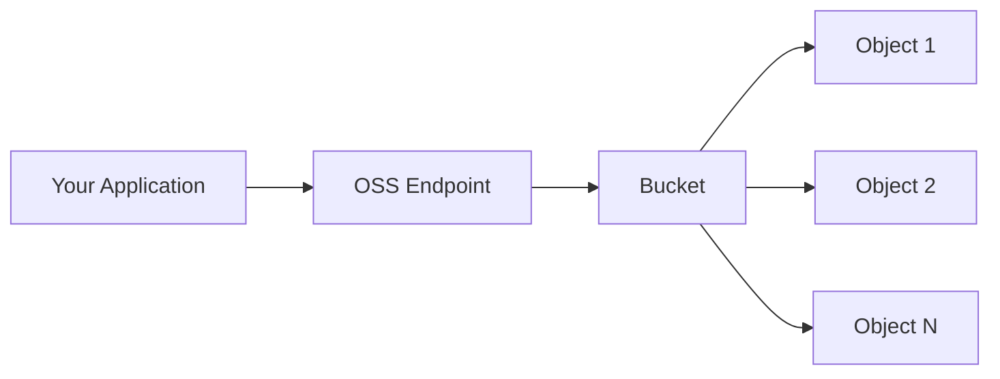

# What is OSS?

Alibaba Cloud Object Storage Service (OSS) is a secure, cost-effective, and highly reliable cloud storage service. It provides 99.9999999999% (twelve 9s) data durability and 99.995% service availability, with platform-independent APIs that let you store and access data from any application, anytime, anywhere.

## Key capabilities

<CardGroup cols={2}>
  <Card title="Massive Scale" icon="database">
    Store unlimited data with no capacity limits per bucket. Individual objects up to 48.8 TB via multipart upload.
  </Card>
  <Card title="Multiple Storage Classes" icon="layer-group">
    Choose from Standard, Infrequent Access, Archive, Cold Archive, and Deep Cold Archive to optimize costs.
  </Card>
  <Card title="Strong Consistency" icon="shield-check">
    Read-after-write consistency for all operations. No stale reads or partial data.
  </Card>
  <Card title="High Bandwidth" icon="gauge-high">
    Up to 100 Gbps download bandwidth per account in select regions for AI and large-scale data analysis.
  </Card>
</CardGroup>

## How OSS works

OSS stores data as **objects** within **buckets**. Each object consists of a key (unique name), data (the file content), and metadata (key-value pairs describing the object).

Unlike traditional file systems, OSS uses a flat structure -- there are no directories or folders. You simulate folder hierarchies by including forward slashes (`/`) in object keys, such as `images/2024/photo.jpg`.

## Common use cases

| Use Case | Description |
|----------|-------------|
| **Web and mobile apps** | Store and serve user-uploaded images, videos, and documents. |
| **Data lake and analytics** | Use OSS as a cloud data lake for AI training, big data processing, and analytics with high-bandwidth access. |
| **Backup and archival** | Archive data cost-effectively with Cold Archive or Deep Cold Archive storage classes. |
| **Static website hosting** | Host static websites directly from an OSS bucket with custom domain support. |
| **Content distribution** | Combine OSS with Alibaba Cloud CDN to distribute content globally with low latency. |
| **Disaster recovery** | Replicate data across regions with cross-region replication (CRR) for business continuity. |

## OSS vs. traditional storage

| Feature | OSS (Object Storage) | Traditional File/Block Storage |
|---------|---------------------|-------------------------------|
| Scale | Unlimited, no capacity planning | Requires provisioning and scaling |
| Durability | 99.9999999999% (12 nines) | Varies by configuration |
| Access | HTTP/HTTPS REST API from anywhere | Network-attached or local access |
| Cost model | Pay-as-you-go, per GB stored | Fixed provisioning costs |
| Metadata | Rich, custom key-value metadata per object | Limited file attributes |
| Structure | Flat namespace (key-value) | Hierarchical (directories) |

## Ways to access OSS

<CardGroup cols={2}>
  <Card title="OSS Console" icon="browser" href="/get-started/quickstart/console">
    Web-based GUI for managing buckets and objects. No installation required.
  </Card>
  <Card title="ossutil CLI" icon="terminal" href="/get-started/quickstart/cli">
    Command-line tool for batch operations, scripting, and automation.
  </Card>
  <Card title="SDKs" icon="code" href="/get-started/quickstart/sdk">
    Libraries for Java, Python, Go, Node.js, PHP, .NET, C++, and more.
  </Card>
  <Card title="REST API" icon="globe" href="/api-reference/overview">
    Platform-independent RESTful API for full programmatic control.
  </Card>
</CardGroup>

## Core features

- **Versioning** -- Protect against accidental deletion or overwrites by keeping previous versions of objects.
- **Encryption** -- Server-side and client-side encryption to protect data at rest.
- **Access control** -- Fine-grained permissions with RAM policies, bucket policies, ACLs, and STS temporary credentials.
- **Lifecycle management** -- Automatically transition objects between storage classes or delete expired data.
- **Cross-region replication** -- Replicate data across regions for disaster recovery and compliance.
- **Image and video processing** -- Resize, crop, watermark, and transcode media on the fly.
- **Event notifications** -- Trigger downstream workflows when objects are created or deleted.

## Billing overview

OSS supports flexible billing:

- **Pay-as-you-go** -- Pay for actual usage with no upfront commitment. Ideal for unpredictable workloads.
- **Resource plans (subscription)** -- Prepay for storage, bandwidth, and requests at discounted rates. Best for predictable workloads.
- **Storage capacity units (SCUs)** -- Offset storage fees across multiple Alibaba Cloud storage services.

For detailed pricing, see [Pricing](/resources/pricing/overview).

## Next steps

<CardGroup cols={2}>
  <Card title="Quickstart: Console" icon="rocket" href="/get-started/quickstart/console">
    Create your first bucket and upload a file in minutes.
  </Card>
  <Card title="Core Concepts" icon="lightbulb" href="/get-started/concepts/buckets">
    Learn about buckets, objects, regions, and storage classes.
  </Card>
</CardGroup>
